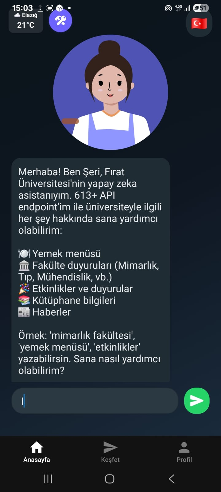
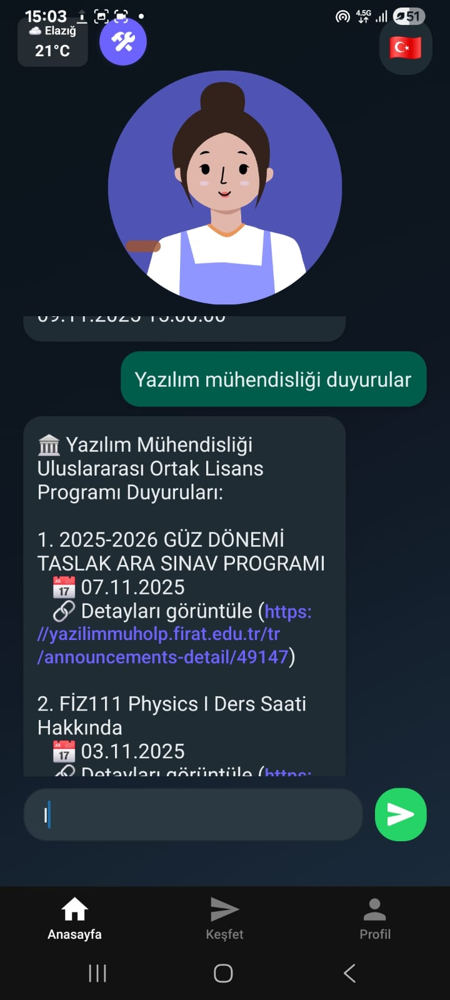
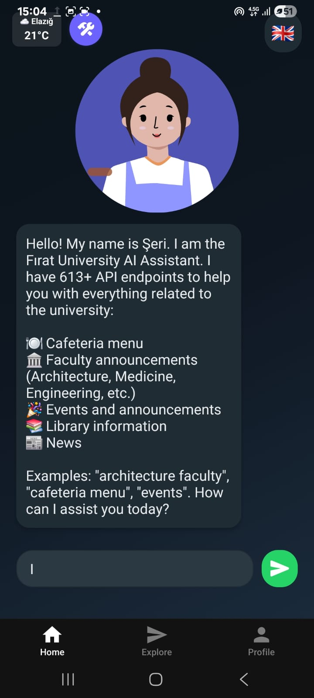

# 🤖 Şeri - Fırat University AI Assistant

> **Note:** For the Turkish version of this documentation, [click here](#-türkçe-açıklama).
> **Not:** Bu dökümantasyonun Türkçe versiyonu için [buraya tıklayın](#-türkçe-açıklama).

---

## 🇺🇸 **English Documentation**

### **🎯 About the Project**
**Şeri** is a modern **AI Assistant** application actively used in a **live production environment** by students and staff at **Fırat University**. It manages over **613+ API endpoints** to provide instant information about university services, faculty announcements, and campus life using advanced **Natural Language Processing (NLP)**.

### 📸 **Screenshots**

<div align="center">
  <table>
    <tr>
      <td align="center">
        <br/>
        **[Chat Interface]**<br/>
        <sub>**AI-powered** messaging interface</sub>
      </td>
      <td align="center">
        <br/>
        **[Weather Widget]**<br/>
        <sub>**Real-time** weather and language selection</sub>
      </td>
      <td align="center">
        <br/>
        **[Faculty News]**<br/>
        <sub>**Dynamic** announcement system</sub>
      </td>
    </tr>
  </table>
</div>

### 📱 **Key Features**
* **🤖 AI Core**: Powered by **Google Gemini AI** for context-aware, human-like responses.
* **🏛️ University Integration**: Real-time access to **Dining Menu**, **Campus Events**, and **Library Status**.
* **📢 Faculty System**: Managed access to **613+ unique endpoints** covering all university departments.
* **🌤️ Weather Integration**: Live weather updates and smart recommendations via **WeatherAPI**.
* **🌍 Multilingual**: Full support for **Turkish** and **English** with dynamic switching.
* **💾 Performance**: Advanced **Hybrid Cache System** (Memory + Persistent) for lightning-fast responses.

### 🛠️ **Tech Stack**
* **Frontend**: **React Native**, **Expo**, **TypeScript**.
* **Backend**: **Node.js**, **Express.js**.
* **AI Engine**: **Google Gemini Pro**.
* **Search**: **Fuse.js** for intelligent fuzzy matching.
* **Storage**: **AsyncStorage** & custom **LRU Cache** logic.

---

## 🇹🇷 **Türkçe Açıklama**

### **🎯 Proje Hakkında**
**Şeri**, Fırat Üniversitesi bünyesinde **canlı üretim ortamında** aktif olarak kullanılan, binlerce öğrenci ve personele hizmet veren modern bir **AI asistan** uygulamasıdır. **613'ten fazla API endpoint'ini** yöneterek üniversite ekosistemine dair tüm bilgileri **Doğal Dil İşleme (NLP)** yetenekleri ile anlık olarak sunar.


### 📸 **Ekran Görüntüleri**

<div align="center">
  <table>
    <tr>
      <td align="center">
        <br/>
        **[Chat Arayüzü]**<br/>
        <sub>**Yapay Zeka** destekli mesajlaşma alanı</sub>
      </td>
      <td align="center">
        <br/>
        **[Hava Durumu]**<br/>
        <sub>**Anlık** hava durumu ve dil seçimi</sub>
      </td>
      <td align="center">
        <br/>
        **[Fakülte Haberleri]**<br/>
        <sub>**Dinamik** duyuru ve haber sistemi</sub>
      </td>
    </tr>
  </table>
</div>

### 📱 **Öne Çıkan Özellikler**
* **🤖 AI Asistan**: **Google Gemini AI** entegrasyonu ile bağlam farkındalıklı yanıtlar.
* **🏛️ Üniversite Entegrasyonu**: **Yemek Menüsü**, **Etkinlikler** ve **Kütüphane Doluluk** oranlarına anlık erişim.
* **📢 Geniş API Ağı**: Tüm fakülteleri kapsayan **613+ farklı endpoint** yönetimi.
* **🌤️ Hava Durumu**: WeatherAPI entegrasyonu ile ana ekranda **canlı tahminler** ve öneriler.
* **🌍 Çoklu Dil**: **Türkçe** ve **İngilizce** dilleri arasında dinamik geçiş desteği.
* **💾 Performans**: **Hybrid Cache** (RAM + Kalıcı Hafıza) stratejisi ile minimum gecikme.

### 🛠️ **Teknolojiler**
* **Frontend**: **React Native**, **Expo**, **TypeScript**.
* **Backend**: **Node.js**, **Express.js** (API Gateway Pattern).
* **Yapay Zeka**: **Google Gemini Pro**.
* **Arama Algoritması**: **Fuse.js** ile akıllı niyet tanıma.
* **Önbellekleme**: **LRU Cache** algoritması ve **AsyncStorage**.

---

### 🚀 **Kurulum (Quick Start)**

1. **Repository'yi klonlayın:**
   ```bash
   git clone <repo-url>

```

2. **Bağımlılıkları yükleyin (Frontend & Backend):**
```bash
npm install && cd backend && npm install

```


3. **Environment (.env) ayarlarını yapın:**
`GEMINI_API_KEY`, `WEATHER_API_KEY` ve `BACKEND_URL` bilgilerini girin.
4. **Çalıştırın:**
```bash
npm start

```


---

### 📊 **Proje İstatistikleri**

* **613+** Yönetilen API Endpoint'i.
* **600+** Entegre Fakülte ve Birim.
* **100MB+** RAM Önbellek Yönetimi.
* **Canlı Kullanım**: Fırat Üniversitesi resmi desteğiyle aktif.

---

### 👤 **Geliştirici**

**Esra Gümüş**

* **GitHub**: [@EsraGumus7](https://github.com/EsraGumus7)

---

<div align="center">

**⭐ Bu projeyi beğendiyseniz yıldız vermeyi unutmayın!**

Made with ❤️ for Fırat University

</div>


# 🤖 Şeri - Fırat Üniversitesi AI Asistanı

<div align="center">


**613+ API Endpoint ile Güçlendirilmiş, Canlı Üretim Ortamında Kullanılan Akıllı Üniversite Asistanı**

[Özellikler](#-özellikler) • [Teknik Detaylar](#-teknik-detaylar) • [Kurulum](#-kurulum) • [Ekran Görüntüleri](#-ekran-görüntüleri)

</div>

---

## 🎯 Proje Hakkında

**Şeri**, Fırat Üniversitesi tarafından **canlı olarak kullanılan** ve binlerce öğrenci ve personel tarafından aktif şekilde kullanılan modern bir AI asistan uygulamasıdır. Bu proje, 613'ten fazla API endpoint'ini yöneterek üniversiteyle ilgili tüm bilgilere erişim sağlar ve kullanıcıların sorularını doğal dil işleme ile anlayarak anında yanıtlar.

### 🌟 Proje Önemi

- ✅ **Canlı Üretim Ortamı**: Fırat Üniversitesi'nin resmi mobil uygulaması olarak aktif kullanılmaktadır
- ✅ **Yüksek Ölçeklenebilirlik**: Binlerce kullanıcıya hizmet vermektedir
- ✅ **Kapsamlı API Entegrasyonu**: 613+ farklı API endpoint'i ile çalışmaktadır
- ✅ **Gerçek Zamanlı Veri**: Hava durumu, yemek menüsü, duyurular ve etkinlikler için canlı veri akışı

---

## 📸 Ekran Görüntüleri

<div align="center">

<table>
<tr>
<td align="center" width="33%">

<br><strong>Ana Ekran - Chat Arayüzü</strong>
</td>
<td align="center" width="33%">

<br><strong>Hava Durumu Widget</strong>
</td>
<td align="center" width="33%">

<br><strong>Fakülte Duyuruları</strong>
</td>
</tr>
</table>

</div>

---

## 💼 Edinilen Beceriler ve Teknolojiler

### 🎨 **Frontend Geliştirme**
- **React Native** - Cross-platform mobil uygulama geliştirme
- **Expo Framework** - Modern React Native geliştirme ortamı
- **TypeScript** - Tip güvenli kod yazımı
- **State Management** - Gelişmiş state kontrolü ve yönetimi
- **Component Architecture** - Yeniden kullanılabilir bileşen mimarisi
- **Responsive Design** - Farklı ekran boyutlarına uyumlu tasarım

### ⚙️ **Backend Geliştirme**
- **Node.js & Express.js** - RESTful API geliştirme
- **API Gateway Pattern** - 613+ endpoint yönetimi
- **Microservices Architecture** - Modüler servis yapısı
- **Route Management** - Dinamik route oluşturma ve yönetimi
- **Middleware Development** - Custom middleware geliştirme

### 🤖 **AI ve Doğal Dil İşleme**
- **Google Gemini AI** - Gelişmiş AI entegrasyonu
- **Natural Language Processing** - Doğal dil anlama ve işleme
- **Intent Recognition** - Kullanıcı niyet tanıma
- **Context-Aware Responses** - Bağlam farkındalıklı yanıtlar

### 🔄 **API Entegrasyonu ve Yönetimi**
- **613+ API Endpoint Yönetimi** - Büyük ölçekli API entegrasyonu
- **RESTful API Design** - Standart API tasarım prensipleri
- **API Gateway Implementation** - Merkezi API yönetimi
- **Third-Party API Integration** - Hava Durumu API, Gemini AI entegrasyonu
- **Rate Limiting** - API kullanım optimizasyonu
- **Error Handling** - Kapsamlı hata yönetimi

### 💾 **Cache ve Performans Optimizasyonu**
- **Hybrid Cache System** - Memory + Persistent cache stratejisi
- **LRU Cache Algorithm** - En az kullanılan öğeleri temizleme
- **Cache Invalidation** - Akıllı cache temizleme mekanizması
- **Performance Optimization** - Uygulama performans optimizasyonu
- **Memory Management** - Bellek sızıntısı koruması

### 🌐 **Network ve Güvenlik**
- **Retry Mechanism** - Exponential backoff ile otomatik tekrar deneme
- **Network Status Monitoring** - Ağ durumu takibi
- **Error Recovery** - Hata kurtarma mekanizmaları
- **Input Validation & Sanitization** - Güvenli veri girişi
- **XSS & SQL Injection Protection** - Güvenlik önlemleri

### 🌍 **Çoklu Dil Desteği**
- **i18n Implementation** - Uluslararasılaştırma
- **Türkçe Desteği** - Tam Türkçe dil desteği
- **İngilizce Desteği** - Tam İngilizce dil desteği
- **Yabancı Dil Desteği** - Genişletilebilir dil mimarisi
- **Dynamic Language Switching** - Dinamik dil değiştirme

### 🧪 **Test ve Kalite Güvencesi**
- **Unit Testing** - Birim testleri
- **Integration Testing** - Entegrasyon testleri
- **Error Handling Testing** - Hata yönetimi testleri
- **Performance Testing** - Performans testleri

### 📱 **Mobil Uygulama Özellikleri**
- **Voice Input** - Sesli giriş desteği
- **Text-to-Speech** - Sesli yanıt verme
- **Offline Support** - Çevrimdışı çalışma desteği
- **Push Notifications** - Bildirim sistemi
- **Deep Linking** - Derin bağlantı desteği

---

## ✨ Özellikler

### 🤖 **AI Asistan Özellikleri**
- **Gemini AI Entegrasyonu** - Google'ın en gelişmiş AI modeli ile doğal dil işleme
- **Akıllı Mesaj Analizi** - Kullanıcı mesajlarını analiz ederek doğru endpoint'e yönlendirme
- **Fuzzy Search** - Fuse.js ile akıllı arama algoritması
- **Context Awareness** - Bağlam farkındalıklı yanıtlar
- **Multi-turn Conversations** - Çoklu tur konuşma desteği

### 🏛️ **Üniversite Veri Entegrasyonu (613+ API)**
- **🍽️ Yemek Menüsü** - Günlük yemek menüsü bilgileri (gerçek zamanlı)
- **🎉 Etkinlikler** - Tüm üniversite etkinlikleri (Türkçe/İngilizce)
- **📢 Duyurular** - Fakülte ve genel duyurular (600+ fakülte)
- **📰 Haberler** - Üniversite haberleri
- **📚 Kütüphane** - Kütüphane katları ve masa durumu
- **🏛️ Fakülte Duyuruları** - Tüm fakültelerin duyuruları (613+ endpoint)

### 🌤️ **Hava Durumu API Entegrasyonu**
- **Gerçek Zamanlı Hava Durumu** - WeatherAPI.com entegrasyonu
- **Günlük Tahmin** - 7 günlük hava durumu tahmini
- **Saatlik Tahmin** - 24 saatlik detaylı tahmin
- **Widget Gösterimi** - Ana ekranda hava durumu widget'ı
- **Akıllı Uyarılar** - Hava durumuna göre otomatik öneriler

### 🎨 **Kullanıcı Arayüzü**
- **WhatsApp Benzeri UI** - Modern ve tanıdık chat arayüzü
- **Gradient Tasarım** - Modern gradient arka planlar
- **Animasyonlar** - Akıcı geçiş animasyonları
- **Avatar Animasyonları** - Konuşma sırasında avatar animasyonları
- **Responsive Layout** - Tüm ekran boyutlarına uyumlu

### 🔧 **Teknik Özellikler**
- **Hybrid Cache Sistemi** - Memory + Persistent (AsyncStorage) cache
- **State Control** - Gelişmiş state yönetimi ve kontrolü
- **Retry Mekanizması** - Exponential backoff ile otomatik tekrar deneme
- **Error Handling** - Kapsamlı global hata yönetimi
- **Input Validation** - Güvenli veri girişi ve sanitization
- **Memory Leak Protection** - Bellek sızıntısı koruması
- **Network Status** - Ağ durumu takibi ve offline desteği

### 🌍 **Çoklu Dil Desteği**
- **Türkçe** - Tam Türkçe dil desteği
- **İngilizce** - Tam İngilizce dil desteği
- **Yabancı Dil Desteği** - Genişletilebilir dil mimarisi
- **Dinamik Dil Değiştirme** - Uygulama içinde anlık dil değiştirme
- **Yerelleştirme** - Tüm içerikler için yerelleştirme

---

## 🏗️ Teknik Detaylar

### 📊 **Mimari Yapı**

```
Frontend (React Native/Expo)
├── State Management (Context API + Hooks)
├── Service Layer (API, Cache, Analysis)
├── Component Architecture
└── Error Boundary & Global Error Handler

Backend (Node.js/Express)
├── API Gateway (613+ Endpoint Management)
├── Controller Layer
├── Service Layer
└── Route Management (Dynamic Routes)
```

### 🔄 **API Yönetim Sistemi**

- **613+ Endpoint** - Otomatik endpoint keşfi ve yönetimi
- **Dynamic Routing** - Dinamik route oluşturma
- **Fuzzy Matching** - Fuse.js ile akıllı endpoint bulma
- **Category Management** - Kategori bazlı endpoint organizasyonu
- **Caching Strategy** - Endpoint bazlı cache stratejileri

### 💾 **Cache Stratejisi**

- **Memory Cache** - Hızlı erişim için RAM cache (100MB limit)
- **Persistent Cache** - AsyncStorage ile kalıcı cache (500MB limit)
- **Hybrid Strategy** - Memory + Persistent kombinasyonu
- **LRU Algorithm** - En az kullanılan öğeleri temizleme
- **TTL Management** - Kategori bazlı TTL yönetimi
- **Auto Cleanup** - Otomatik cache temizleme

### 🔁 **Retry Mekanizması**

- **Exponential Backoff** - Üstel geri çekilme algoritması
- **Network Error Retry** - Ağ hatalarında otomatik tekrar
- **Timeout Handling** - Zaman aşımı yönetimi
- **Max Retry Limit** - Maksimum tekrar sayısı kontrolü

### 🛡️ **Güvenlik Özellikleri**

- **Input Validation** - Kapsamlı girdi doğrulama
- **XSS Protection** - Cross-site scripting koruması
- **SQL Injection Prevention** - SQL enjeksiyon önleme
- **Sanitization** - Veri temizleme ve sanitization
- **Rate Limiting** - İstek hızı sınırlama

---

## 🚀 Kurulum

### Gereksinimler
- Node.js (v16 veya üzeri)
- npm veya yarn
- Expo CLI
- Android Studio (Android için)
- Xcode (iOS için)

### 1. Projeyi Klonlayın
```bash
git clone <repository-url>
cd firat-asistan
```

### 2. Bağımlılıkları Yükleyin

**Frontend (React Native/Expo):**
```bash
npm install
```

**Backend (Node.js):**
```bash
cd backend
npm install
```

### 3. Environment Variables Ayarlayın

**Backend için `.env` dosyası oluşturun:**
```env
PORT=3000
NODE_ENV=development
FIRAT_DDYO_URL=https://ddyo.firat.edu.tr
FIRAT_MAIN_URL=https://www.firat.edu.tr
MAIN_TOKEN=your_token_here
GEMINI_API_KEY=your_gemini_key_here
WEATHER_API_KEY=your_weather_key_here
```

**Frontend için `.env` dosyası oluşturun:**
```env
EXPO_PUBLIC_BACKEND_URL=http://your-ip:3000/api
EXPO_PUBLIC_API_BASE_URL=http://your-ip:3000
```

### 4. Uygulamayı Çalıştırın

**Backend'i başlatın:**
```bash
cd backend
npm start
```

**Frontend'i başlatın:**
```bash
npm start
```

---

## 📱 Kullanım

### Temel Kullanım
1. Uygulamayı açın
2. Dil seçiminizi yapın (Türkçe/İngilizce)
3. Sorunuzu yazın veya sesli olarak sorun
4. AI asistan size yanıt verecek

### Örnek Sorular
- "Bugün ne yemek var?"
- "Mimarlık fakültesi duyuruları"
- "Kütüphane masa durumu"
- "Bu hafta etkinlikler neler?"
- "Tıp fakültesi duyuruları"
- "Hava durumu nasıl?"

---

## 📊 Proje İstatistikleri

- **613+ API Endpoint** - Yönetilen endpoint sayısı
- **600+ Fakülte** - Duyuru sistemi entegrasyonu
- **3 Dil Desteği** - Türkçe, İngilizce, Yabancı diller
- **100MB Memory Cache** - Hızlı erişim için
- **500MB Persistent Cache** - Kalıcı veri depolama
- **Canlı Kullanım** - Fırat Üniversitesi tarafından aktif kullanım

---

## 🛠️ Geliştirici Rehberi

Detaylı geliştirici dokümantasyonu için:
- [API Dokümantasyonu](docs/API.md)
- [Kod Dokümantasyonu](docs/CODE_DOCUMENTATION.md)
- [Geliştirici Rehberi](docs/DEVELOPER_GUIDE.md)


## 📄 Lisans

Bu proje MIT lisansı altında lisanslanmıştır.

---

## 👥 Geliştirici

**Esra** - Fırat Üniversitesi AI Asistanı Projesi

Bu proje, Fırat Üniversitesi'nin resmi mobil uygulaması olarak geliştirilmiş ve canlı üretim ortamında aktif olarak kullanılmaktadır.

---

<div align="center">

**⭐ Bu projeyi beğendiyseniz yıldız vermeyi unutmayın!**

Made with ❤️ for Fırat University

</div>
